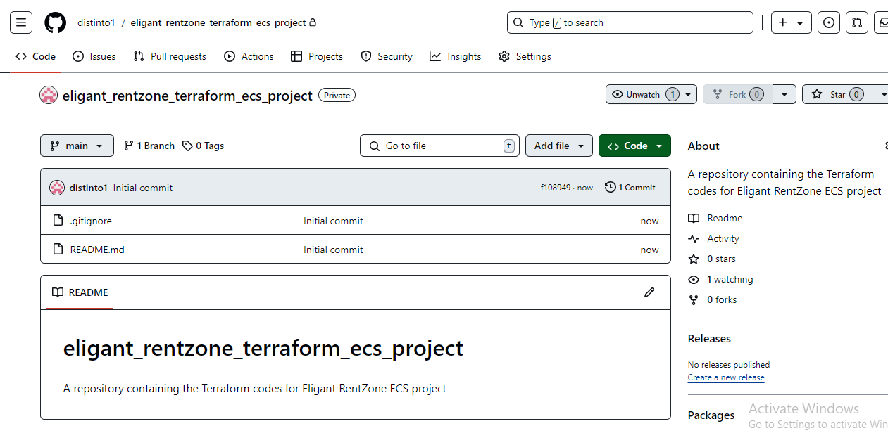
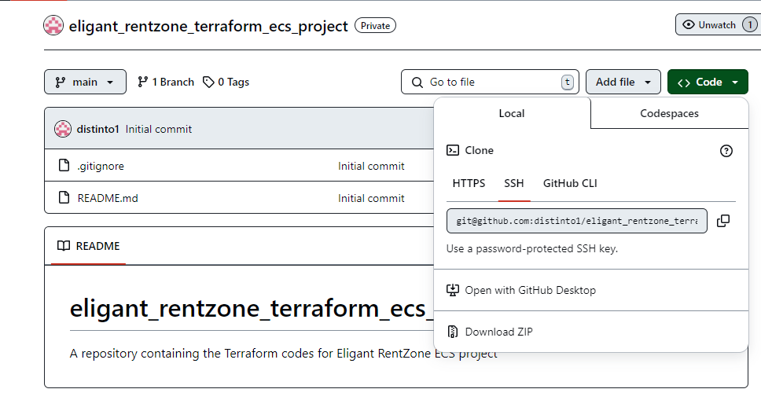
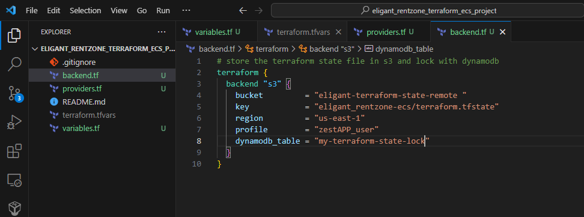
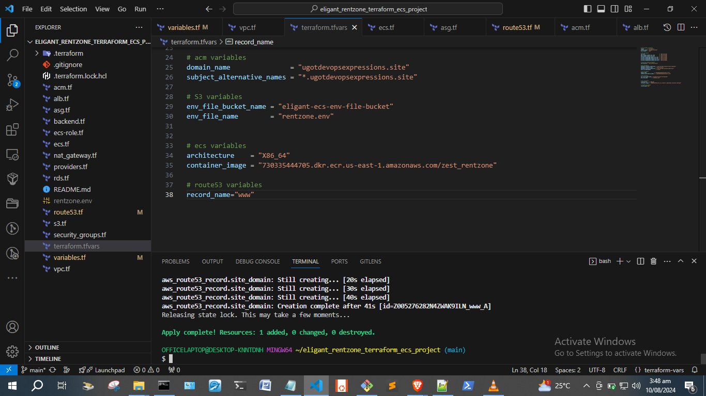

# Deploy Dynamic Web App on AWS with Terraform Docker Amazon ECR & ECS

## Project Overview

This project demonstrates how to deploy a dynamic web application on AWS using Terraform for infrastructure as code, Docker for containerization, and Amazon ECR and ECS for container orchestration. The architecture is designed to be scalable, highly available, and secure, leveraging various AWS services to achieve these goals.

## Use Case

This project is ideal for deploying a web application that requires:

* Scalability: With ECS and Auto Scaling, the application can handle varying loads.
  
* High Availability: Utilizing multiple availability zones and load balancing.
  
* Security: By segregating application and database components into private subnets and securing access with IAM roles and security groups.
  
* Automated Infrastructure: With Terraform automating the setup and configuration of AWS resources.

## Prerequisites

Before you start, make sure you have the following tools installed:

* Terraform: Installed and configured.
* Docker Image: Application Image stored in Amazon ECR.
* Git: Installed and connected to your GitHub account.
* AWS CLI : configured with appropriate IAM user credentials.
* VS Code: With extensions for Terraform and Docker
* SSH Key Pairs: For secure connections.
* RDS snapshot
* Environment file

You will also need:

* An AWS account
* GitHub account for version control

## Architecture Diagram

The architecture includes:

* Amazon Route 53: DNS service to direct user traffic.
* VPC with Subnets:
    *  2 Public Subnets (10.0.0.0/24 and 10.0.1.0/24) for the NAT Gateway and ALB.
    *  4 Private Subnets for App (10.0.2.0/24, 10.0.3.0/24) and DB (10.0.4.0/24, 10.0.5.0/24).
* NAT Gateway: To allow instances in private subnets to access the internet.
* Application Load Balancer (ALB): For distributing incoming traffic across ECS services.
* Amazon ECS (Elastic Container Service): To run Docker containers.
* Amazon ECR (Elastic Container Registry): To store Docker images.
* Amazon RDS (Relational Database Service): For database services with a master and standby instance.
* Amazon S3: For storing environment files.
* Amazon DynamoDB: For locking Terraform state.
* IAM Roles: To ensure secure access to services.
* Auto Scaling Group: To ensure the app scales based on demand.

## Step-by-Step Project Setup Instructions

1. Install and Setup Terraform:

    * Install Terraform on your local machine and verify the installation.

1. Version Control:

    * Create a GitHub repository and set up Git on your computer.
    * Generate SSH key pairs for secure access into GitHub. This will be done by uploading the generated public key pair into Github which will enable you to clone your Github repository.

1. Development Environment:

    * Install Visual Studio Code and add Terraform and Docker extensions to improve efficiency.

1. AWS Setup:

    * Install and configure the AWS CLI.
        

    * Create an IAM user and generate access keys.
    * Run aws configure to set up your credentials locally.
    
1. S3 and DynamoDB for Terraform State:

    * Create an S3 bucket for storing the Terraform state files.
    
    
    

    * Create a DynamoDB table to lock Terraform state and prevent concurrent operations.
    
    
    

1. Terraform Configuration:

    * Create a GitHub repository to store terraform codes. Then clone the repository to your computer.
    
    
    
    
    * Define and create environment variables (region,project-name,environment) for the project.
    
    * Use terraform.tfvars to assign values to the variables you have created.
    
    * Configure AWS provider to establish secure connection between terraform and AWS.
    
    * Configure the backend to store the terraform state and lock with DynamoDB
    
    * Initialize Terraform with AWS environment using terraform init after all configurations.
    

    
1. VPC and Networking:

    * Create a 3-tier VPC with public and private subnets across two availability zones.
    
    
    * Set up NAT Gateways and Route Tables to manage traffic between public and private subnets.
    

1. Security Groups:

    * Create security groups for the Application Load Balancer, Bastion host, app servers, and databases.
    

1. Database Layer:

    * Deploy an RDS instance from a snapshot to serve as the application's database.
    
    

1. Load Balancer and Auto Scaling:

    * Set up an Application Load Balancer to distribute traffic.
    
    

    * Create an Auto Scaling Group connected to ECS to manage container scaling.
    

1. S3 Bucket:
    * Upload environment file into terraform.
    * add environment file to .gitignore file because it contains senstivie data that must not be exposed.
    * Create an s3 bucket and upload the envirnoment file into the s3 bucket.

1. ECS and ECR:

    * Retrive the URI of Docker image in Amazon ECR.
    * Create an ECS task execution role and ECS service using Terraform, and link them to the Auto Scaling Group.
    
    
    

1. DNS and SSL:

    * Configure Route 53 for DNS routing to your application.
    
    * Use AWS Certificate Manager (ACM) to manage SSL certificates for secure connections.
    
    

1. Deployment:

    * Run terraform apply to deploy the infrastructure and application.
    * Access your application through the domain printed by Terraform.
    
